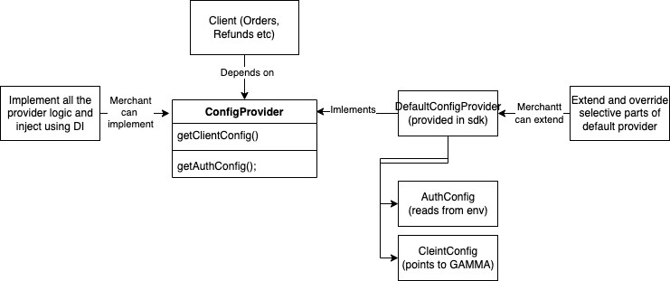
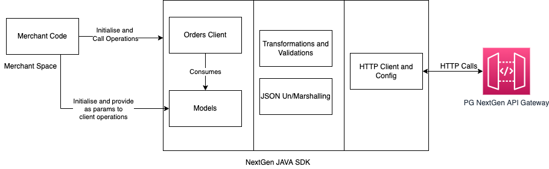

# Cashfree Java SDK for rest apis

## Installation

### Requirements

- Java 1.8 or later

### Gradle users

Add this dependency to your project's build file:

```groovy
implementation 'com.cashfree.pg:nextgen-java-sdk:1.0.0'
```

Add the following repository in repositories section of build file:

```groovy
repositories {
      maven {
            url "https://maven.cashfree.com/release"
      }
}
```

### Maven users

Add this dependency to your project's POM:

```xml
<dependency>
  <groupId>com.cashfree.pg</groupId>
  <artifactId>nextgen-java-sdk</artifactId>
  <version>1.0.0</version>
</dependency>
```

Add the following repository in repositories section of pom:

```xml
<repositories>
      <repository>
            <id>cashfree</id>
            <url>https://maven.cashfree.com/release</url>
      </repository>
</repositories>
```

## Documentation

## Usage

There are following core componets of java sdk:

1. Configuration and URLs (Configuration)
2. Clients and Models (Operation)

### Configuration and Url



Configuration of SDK requires you to have a class of type "ConfigProvider" which is responsible to provide
CashfreeAuthConfig and CashfreeHttpClientConfig. The url mapping to cashfree nextgen based on stage is done using the domain
parameter of "CashfreeHttpClientConfig" class.

1. Extend the DefaultConfigProvide class in your own class or create a new class.

```java
public class MainConfigProvider extends DefaultConfigProvider {

    @Override
    public CashfreeHttpClientConfig getClientConfig() {
        return CashfreeHttpClientConfig.builder()
                .domain(Domain.GAMMA)
                .apiVersion("2022-01-01")
                .build();
    }
    
    // default auth config being provided by reading environment
  // variables directly
}
```

2. Or you can implement the ConfigProvider interface to implement methods to provide suitable values in the AuthConfig and ClientConfig classes.
      In this manner you can fetch credentials from files or transfer it from your own service to the library.

```java
public static class DependencyManagedConfigProvide implements ConfigProvider {

  // these can be injected from a deployment environment
  @Value("${cashfree.nextgensdk.key}") String key;

  @Value("${cashfree.nextgensdk.secret}") String secret;

  @Override
  public CashfreeHttpClientConfig getClientConfig() {
    return CashfreeHttpClientConfig.builder()
        .domain(Domain.SANDBOX)
        .apiVersion("2022-01-01")
        .maximumHttpClientRetries(1)
        .build();
  }

  @Override
  public CashfreeAuthConfig getAuthConfig() {
    return CashfreeAuthConfig.builder()
        .apiKey(this.key)
        .clientId(this.secret)
        .build();
  }
}
```

By default, the DefaultConfigProvider, if used, points the CashfreeHttpClient to Gamma and api version 1.
It defaults the api credentials to whatever values the system environment has set.
Keys used to fetch the values:

API key (secret): cashfreeApiKey

ClientId Key: cashfreeClientId

Make sure these env variable keys-value are set correctly in the system environment when you are using DefaultConfigProvider to provide credentials to OrdersClient.
If no credentials are found, the api will return a http status 401.

### Operation



The main point of interaction for merchants is ought to be the OrdersClient and Models package.

1. OrdersClient exposes operations that can be done using suitable model objects and params.
2. The merchants can initialise the OrdersClient using the ways provided below.
3. Merchants have to create models of required type to do operations like create order etc using the ordersClient.
4. Model validation and transformation is done by sdk itself.

Example creating an order

```java
import cashfree.exception.CashfreeException;
import cashfree.models.request.CreateOrderRequest;
import cashfree.models.response.CreateOrderResponse;
import cashfree.models.CustomerDetails;
import java.util.Currency;

public class NextGenExample {

      ConfigProvider configProvider;
      OrdersClient ordersClient;

      NextGenExample(@Autowire ConfigProvider configProvider) {
            this.configProvide = configProvider;
            this.ordersClient = new OrdersClient(configProvider);
      }

      public void CreateOrderExample() {

            CustomerDetails customerDetails =
                    CustomerDetails.builder()
                            .customerName("Customer 1")
                            .customerId(1234)
                            .customerPhone("987654321")
                            .customerMail("customer1@customer.com")
                            .build();
            CreateOrderRequest createOrderRequest =
                    CreateOrderRequest.builder()
                            .orderId(5678)
                            .orderAmount(100.00)
                            .currency(Currency.getInstance("INR"))
                            .customerDetails(customerDetails)
                            .build();
            try {
                  CreateOrderResponse createOrderResponse =
                          this.ordersClient.createOrder(createOrderRequest);
                  log.info(createOrderResponse.getCfOrderId());
            } catch (CashfreeException ce) {
                  log.error(ce.getCashfreeErrorMessage());
                  throw ce;
            }
      }
}
```

Providing config to client using DI

```java
package cashfree;

import cashfree.client.OrdersClient;
import cashfree.config.*;
import cashfree.models.*;
import com.fasterxml.jackson.core.JsonProcessingException;
import com.fasterxml.jackson.databind.ObjectMapper;

import java.io.IOException;
import java.nio.file.Files;
import java.nio.file.Paths;

public class NextGenExample {

  ConfigProvider configProvider;
  OrdersClient ordersClient;

  NextGenExample(@Autowire ConfigProvider configProvider) {
    this.configProvide = configProvider;
    this.ordersClient = new OrdersClient(configProvider);
  }

  // test methods
}
```

testable main.java

```java
package cashfree;

import cashfree.client.OrdersClient;
import cashfree.config.*;
import cashfree.models.request.CreateOrderRequest;
import cashfree.models.request.GetOrderRequest;
import cashfree.models.request.PayOrderRequest;
import cashfree.models.response.PayOrderResponse;
import com.fasterxml.jackson.databind.ObjectMapper;

import java.io.IOException;
import java.nio.file.Files;
import java.nio.file.Paths;

public class main {

      public static void main(String[] args) {

            ObjectMapper objectMapper = new ObjectMapper();

            CreateOrderRequest createOrderRequest = null;
            GetOrderRequest getOrderRequest = null;
            PayOrderRequest payOrderRequest = null;
            try {
                  createOrderRequest = objectMapper.readValue(
                          getResourceAsString(
                                  "src/main/resources/test_data/create_order_request1.json"),
                          CreateOrderRequest.class
                  );
                  getOrderRequest = objectMapper.readValue(
                          getResourceAsString(
                                  "src/main/resources/test_data/get_order_request1.json"),
                          GetOrderRequest.class
                  );
                  payOrderRequest = objectMapper.readValue(
                          getResourceAsString(
                                  "src/main/resources/test_data/pay_order_request1.json"),
                          PayOrderRequest.class
                  );
            } catch (IOException ioException) {
                  System.out.println("error");

            }

            OrdersClient ordersClient = new OrdersClient(new MainConfigProvider());
            try {
//            CreateOrderResponse response = ordersClient.createOrder(createOrderRequest);
//            GetOrderResponse response = ordersClient.getOrder(getOrderRequest);
                  PayOrderResponse response = ordersClient.payOrder(payOrderRequest);
                  System.out.println(response.getPaymentMethod());
//            System.out.println(response.getCfOrderId());
            } catch (Exception e) {
                  System.out.println("json error");
            }
      }

      public static class MainConfigProvider extends DefaultConfigProvider {

            @Override
            public CashfreeHttpClientConfig getClientConfig() {
                  return CashfreeHttpClientConfig.builder()
                          .domain(Domain.GAMMA)
                          .apiVersion(1)
                          .build();
            }
      }

      public static String getResourceAsString(String path) throws IOException {
            return new String(Files.readAllBytes(
                    Paths.get(path))
            );
      }
}

```

Sample PayOrderRequest.json to be put in path used in above example

```json
{
  "order_token": "{{orderToken}}",
  "payment_method": {
    "card": {
      "channel": "native",
      "card_number": "4111111111111111",
      "card_holder_name": "Card Holder",
      "card_expiry_mm": "06",
      "card_expiry_yy": "2022",
      "card_cvv": 900
    }
  }
}
```

### The SDK exposes different clients for different business use cases.

- OrdersClient

Each client has ConfigProvider class as a class property which you can provide by extending or overriding the existing ConfigProvider.
Each client exposes operations that are 1:1 mapping of operations that is exposed by the api gateway.

## Development and Testing
TODO

[cashfree]: https://cashfree.com
